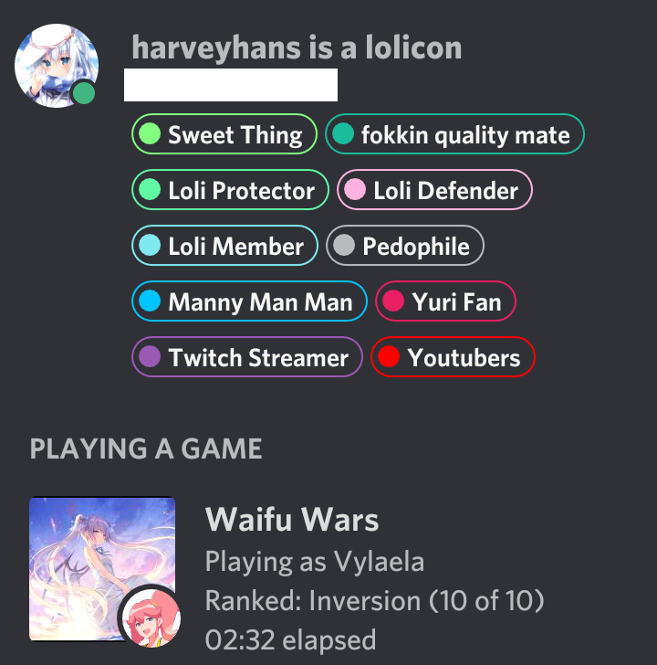

# eidolonrp
A rich presence selfbot.

<table>
<tr><th>ENV</th><th>ENV Description</th></tr>
<tr><td>token*</th><td>user account token</td></tr>
<tr><td>appid*</td><td>the application's id to use with its rich presence assets</td></tr>
<tr><td>name*</td><td>header of the rich presence</td></tr>
<tr><td>url</td><td>twitch stream url (only used when type=1)</td></tr>
<tr><td>type*</td><td>(int) type of the activity. 0: playing, 1: streaming, 2: listening, 3: watching</td></tr>
<tr><td>state*</td><td>second line of the rich presence</td></tr>
<tr><td>details*</td><td>third line of the rich presence</td></tr>
<tr><td>partysize*</td><td>(int) party members count</td></tr>
<tr><td>partymax*</td><td>(int) max party members size</td></tr>
<tr><td>largeimage*</td><td>rich presence asset large image id</td></tr>
<tr><td>largetext*</td><td>text tip for the large image</td></tr>
<tr><td>smallimage*</td><td>rich presence asset small image id</td></tr>
<tr><td>smalltext*</td><td>text tip for the small image</td></tr>
</table>

## Preview
