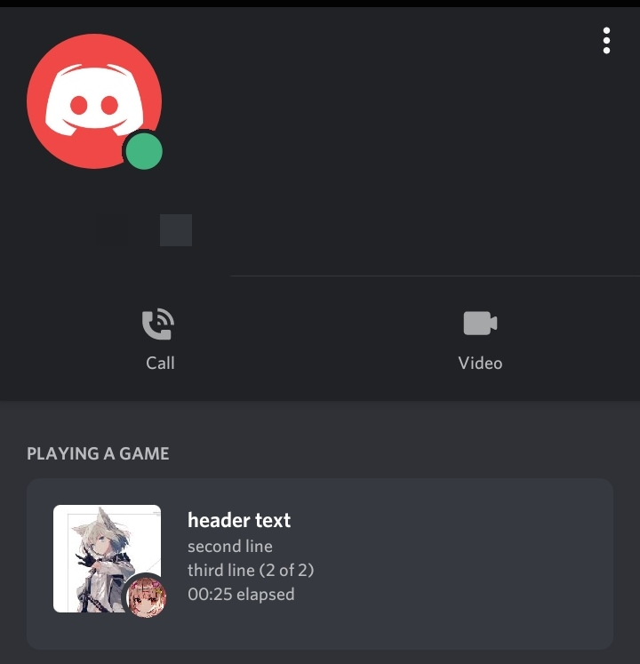
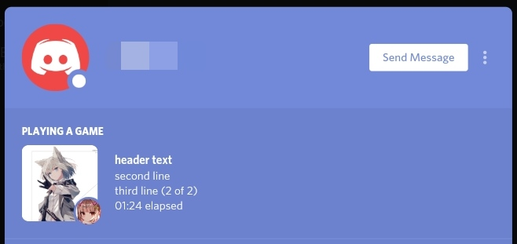

# DISCONTINUED. Discord API has banned the usage of user account tokens so this self-bot will not work anymore.

# eidolonrp [](https://www.codefactor.io/repository/github/kairusds/eidolonrp)
A simple rich presence changer built with discord.py

**Python 3.6+ is required to run this script.**

Table of Contents
=================

   * [Preview](#preview)
   * [Where do I get the rich presence image IDs?](#where-do-i-get-the-rich-presence-image-ids)
   * [config.ini](#configini)
   * [Termux instructions](#termux-instructions)

## Preview



# Where do I get the rich presence image IDs?
<p>You can get these by right-clicking an asset image's icon and copying the URL in the Rich Presence > Art Assets section on the Discord Developer Portal.</p>
<p>The URL should be something like this <code>https://cdn.discordapp.com/app-assets/632447779013458728/655561063797872711.png</code>[1]</p>
<p>The first 18-digit string should be the app's ID <code>632447779013458728</code>, while the second 18-digit string <code>655561063797872711</code>, is the image's ID and it is what you need to input in the config.</p>
* [1] <sub><sup>The 18-digit numbers are only an example and is generated with random.org</sup></sub>

<sub>Video soon.</sub>

# `config.ini`
```
[user]
token = user account token

[assets]
largeimage = large image filename
largetext = large image text tip
smallimage = small image filename
smalltext = small image text tip

[party]
# yes or no
enabled = yes
size = 2
maxsize = 2

[activity]
appid = your client id
name = header text
state = third line
details = second line
# 0: playing, 1: streaming, 2: listening, 3: watching, 4: custom, 5: competing
type = 0
# change this if you're using streaming activity (experimental)
# don't use an invalid url
url = https://twitch.tv/username
# can only be online, idle or dnd to make the rich presence work
status = online
```

# Termux instructions
1. Download Termux from F-Droid (you can also download from the play store but that's outdated) 
Optional: download hacker keyboard from playstore so that moving is easier, though, vim has touch support so only use hacker keyboard if you are going to use nano instead
2. Launch Termux and do `pkg upgrade && pkg install python git vim`
3. Do `git clone https://github.com/kairusds/eidolonrp` to download this
4. Then do `cd eidolonrp && pip install -r requirements.txt`
5. Then edit the config file with `vim confing.ini` or if you are going to use hacker keyboard, `nano index.py`. Replace the text with your input as suggested in [config.ini](#configini).
6. Finally, run the script with `python index.py`
To exit, do CRTL+C or simply exit Termux